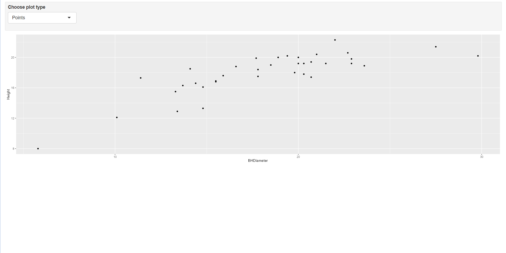

# Tasks

## Task 1
```{r}
getwd();
```

## Task 2
```{r}
sp <- read.csv('SPRUCE.csv')
head(sp)
```

## Task 3
```{r}
with(sp,{
  plot(Height~BHDiameter,
     bg="Blue",
     pch=21,
     cex=1.2,
     ylim=c(0,1.1*max(Height)),
     xlim=c(0,1.1*max(BHDiameter)),
     main="BHDiameter vs Height",
     xlab="BHDiameter (cm)",
     ylab="Height (m)",
     )
  }
)
```

There appears to be a straight line relationship in the data. However, the data does have a slight curve to it that may cause an issue.

```{r}
library(s20x)
layout(matrix(1:4,nr=2,nc=2,byrow=FALSE))
trendscatter(Height~BHDiameter, f=0.5, data=sp)
trendscatter(Height~BHDiameter, f=0.6, data=sp)
trendscatter(Height~BHDiameter, f=0.7, data=sp)
```

```{r}
spruce.lm = with(sp, lm(Height~BHDiameter))
with(sp,{
  plot(Height~BHDiameter,
     bg="Blue",
     pch=21,
     cex=1.2,
     ylim=c(0,1.1*max(Height)),
     xlim=c(0,1.1*max(BHDiameter)),
     main="BHDiameter vs Height",
     xlab="BHDiameter (cm)",
     ylab="Height (m)",
     )
  abline(spruce.lm)
  }
)
```

The straight line is not appropriate for the data.

## Task 4
```{r}
layout(matrix(1:4,nr=2,nc=2,byrow=TRUE))
## With fitted line
yhat=fitted(spruce.lm)
with(sp,{
  plot(Height~BHDiameter,
        bg="Blue",
        pch=21,
        cex=1.0,
        ylim=c(0,1.1*max(Height)),
        xlim=c(0,1.1*max(BHDiameter)),
        main="Fitted Line",
        xlab="BHDiameter (cm)",
        ylab="Height (m)",
     )
  }
)

abline(spruce.lm)

## With RSS

with(sp,{
  plot(Height~BHDiameter,
        bg="Blue",
        pch=21,
        cex=1.0,
        ylim=c(0,1.1*max(Height)),
        xlim=c(0,1.1*max(BHDiameter)),
        main="Fitted Line and RSS",
        xlab="BHDiameter (cm)",
        ylab="Height (m)",
     )
  }
)

with(sp,{
      segments(BHDiameter,Height,BHDiameter,yhat)
      }
    )

abline(spruce.lm)

## With MSS

with(sp,{
  plot(Height~BHDiameter,
        bg="Blue",
        pch=21,
        cex=1.0,
        ylim=c(0,1.1*max(Height)),
        xlim=c(0,1.1*max(BHDiameter)),
        main="Fitted line, RSS, and MSS",
        xlab="BHDiameter (cm)",
        ylab="Height (m)",
     )
  }
)

with(sp, abline(h=mean(Height)))
abline(spruce.lm)

with(sp, segments(BHDiameter,mean(Height),BHDiameter,yhat,col="Red"))

## With TSS
with(sp,{
  plot(Height~BHDiameter,
        bg="Blue",
        pch=21,
        cex=1.0,
        ylim=c(0,1.1*max(Height)),
        xlim=c(0,1.1*max(BHDiameter)),
        main="MSS and TSS",
        xlab="BHDiameter (cm)",
        ylab="Height (m)",
     )
  }
)

with(sp,abline(h=mean(Height)))

with(sp, segments(BHDiameter,Height,BHDiameter,mean(Height),col="Green"))
```

### Calculate RSS, MSS, and TSS
```{r}
RSS=with(sp,sum((Height-yhat)^2))
MSS=with(sp,sum((yhat-mean(Height))^2))
TSS=with(sp,sum((Height-mean(Height))^2))
RSS
MSS
TSS
```

### Calculate MSS/TSS and interpret
```{r}
MSS/TSS
```
This means that around 65.7% of the variation in the data is explained by predicting the outcome using the fitted line.
### TSS = MSS + RSS?
```{r}
TSS
MSS+RSS
```

Yes, TSS = MSS + RSS

## Task 5
```{r}
summary(spruce.lm)
```
### Slope
0.48147

### Intercept
9.14684

### Equation
$$HEIGHT = 0.148147x + 9.14684$$

### Predict
```{r}
predict(spruce.lm, data.frame=(BHDiameter = c(15, 18, 20)))
```

##Task 6
```{r}
library(ggplot2)

g = ggplot(sp, aes(x = BHDiameter, y = Height, color=BHDiameter)) + 
  geom_point() + 
  geom_line() + 
  geom_smooth(method = "lm") +
  ggtitle("Height vs BHDiameter")
g
```

## Task 7
{ width=80% }
{ width=80% }
{ width=80% }